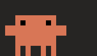
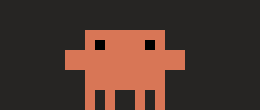
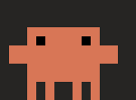
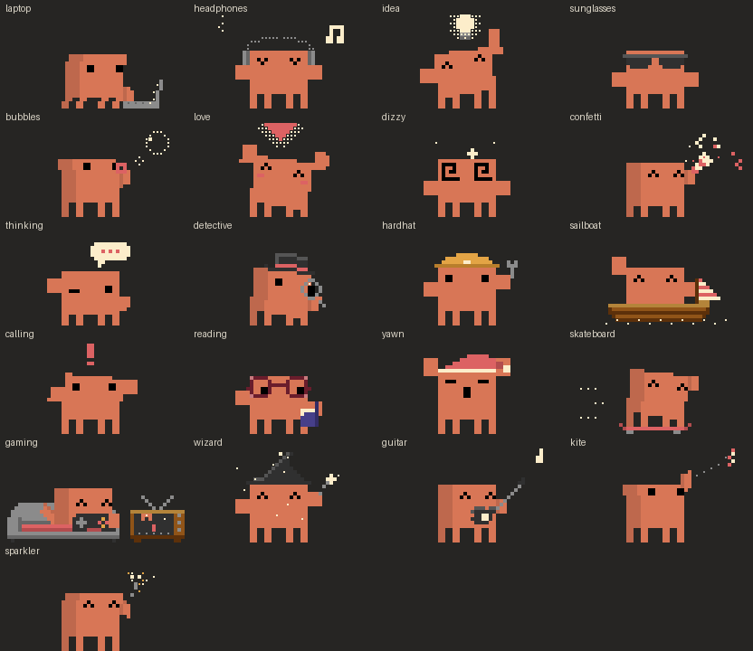

# Clawde

A little Clawd who lives on your Mac, just above the Dock, and acts out what you and [Claude Code](https://claude.com/claude-code) are up to.

<p>
  
  
  
</p>

> **An unofficial fan project.** Clawd is the mascot of Anthropic's Claude Code, and Clawd and Claude are Anthropic's. Clawde isn't made, endorsed or supported by Anthropic, and ships none of Anthropic's artwork: every animation is drawn for this project in the style of the official pixel art, some of them after official ones.

## What Clawd does

**Along with Claude Code.** Clawd reads your Claude Code transcripts (in `~/.claude/projects`, read-only, nothing leaves your Mac) to see what Claude is doing, across every session at once:

| Claude is… | Clawd… |
| --- | --- |
| thinking | ponders with a thought bubble |
| starting to work | has an idea 💡, then pulls out its laptop and types |
| looking things up (reads, searches) | puts on a top hat and peers through a magnifying glass |
| changing lots of code | puts on a hard hat and swings a wrench |
| committing or pushing | sets sail in a little wooden boat |
| waiting for your answer | waves at you with a big **!** |
| done | cheers: confetti, sunglasses or a heart |

**Along with you.** It notices what you're doing:

- **Playing a game** (anything the Mac files as a game, anything from your Steam library, or Minecraft): a sofa and an old TV appear and Clawd plays along.
- **Listening to music** in Music or Spotify: headphones on, grooving.
- **Reading or coding** in Preview, Books or VS Code: glasses and a book.
- **Sitting still** for a while: blows bubbles. **Away** for five minutes: naps. **Back** after ten: a heart and a welcome.
- **Two hours without a break**: gets dizzy and tells you to stretch. **Late at night**: yawns in a nightcap. **At the weekend**: goes skateboarding.

**Always.** Its eyes follow your pointer. It paces about a little, and you can drag it, throw it (hard enough and it lands dizzy) or poke it for a hop and a heart. Right-click it or use the menu-bar icon to make it perform any of its 21 actions, resize it, put it to sleep, have it open at login or run a demo of everything above.



## Install

1. Download `Clawde.zip` from the [latest release](../../releases/latest) and unzip it.
2. Move `Clawde.app` to your Applications folder and open it.
3. Clawde isn't notarized by Apple, so the first time macOS says it can't check it. Open **System Settings → Privacy & Security**, scroll down and click **Open Anyway** next to Clawde. You only need to do this once.

Clawde needs macOS 14 or later and runs on Apple silicon and Intel Macs. It lives in the menu bar (no Dock icon); quit it from there, and turn on **Open at Login** there to keep Clawd around.

### Permissions it may ask for

- **Automation** for Music or Spotify, the first time one is playing: so Clawd can tell a song is on. Clawde never starts a player itself.
- **Accessibility** (optional, only if you turn on chat and ask for it): to read the front window's title for Clawd's chat.

### Chatting with Clawd (optional)

Turn on **Connect to Claude** in the menu and double-click Clawd to talk to it. Chat runs through your own [Claude Code](https://claude.com/claude-code) command-line tool (`claude` must be installed and signed in) with a light model, and uses your own plan. Clawd keeps a few notes about you in `~/Library/Application Support/Clawde/notes.md`; the menu can open them or make Clawd forget everything.

## Build from source

You need the Xcode Command Line Tools (`xcode-select --install`).

```sh
./build.sh            # builds build/Clawde.app for Apple silicon and Intel
open build/Clawde.app
```

`ARCHS=arm64 ./build.sh` builds just one architecture, faster.

The animations are drawn in code: `tools/design_actions.py` writes each action as a pixel-art Lottie file in `assets/actions/` (and, with `--preview`, GIFs and contact sheets in `build/previews/`, which need [Pillow](https://python-pillow.org)), and `tools/import_clawd.py` bundles them into `Resources/clawd-animations.json`. After changing an animation:

```sh
python3 tools/design_actions.py --preview laptop
python3 tools/import_clawd.py
./build.sh
```

A few command-line switches help while working on it:

| | |
| --- | --- |
| `Clawde --simulate` | runs a scripted day without showing Clawd; with `CLAWD_DEBUG=1` it logs what Clawd does |
| `Clawde --claude-state` | prints what Clawd reads from your Claude Code sessions |
| `Clawde --games` | lists which running apps Clawd counts as games |
| `Clawde --sheet out.png` | draws every built-in pose to one image |

## License

The code is under the [MIT License](LICENSE). Clawd, the character, belongs to Anthropic and isn't covered by it.
